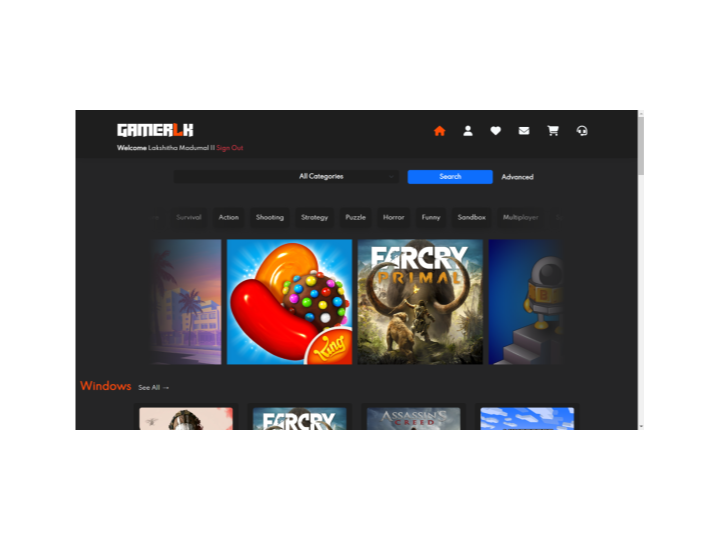
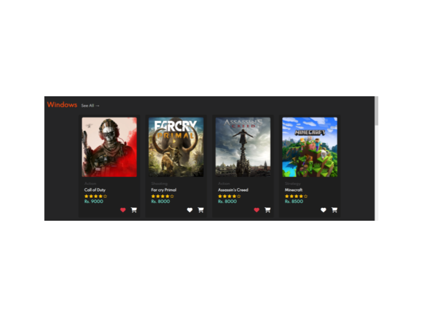
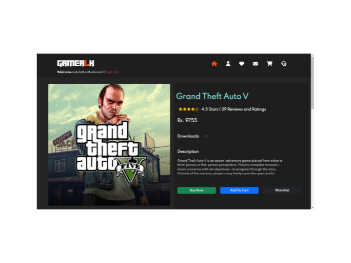
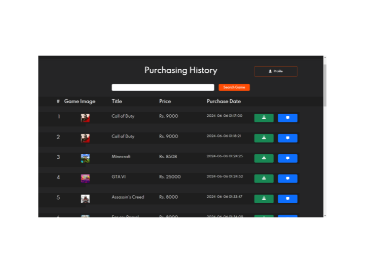
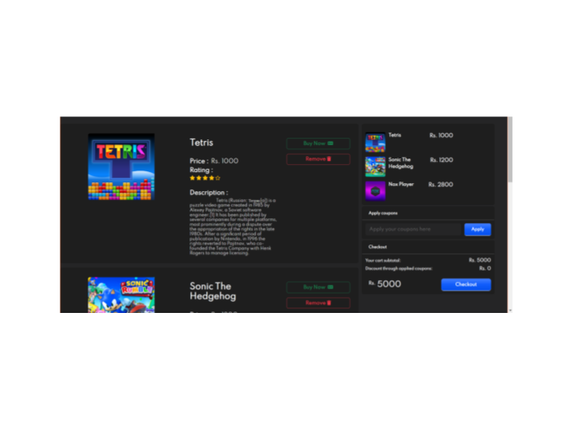
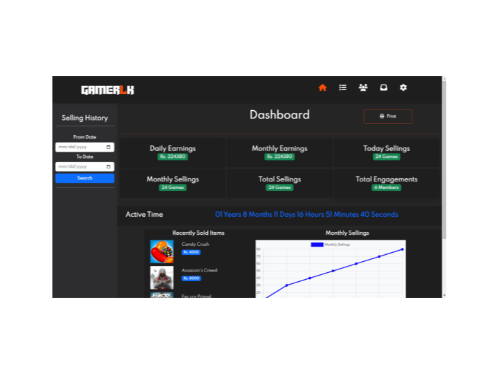
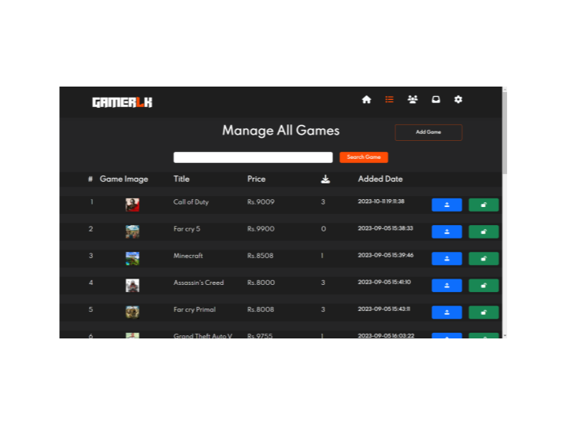
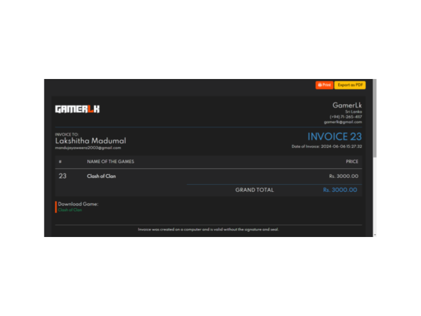
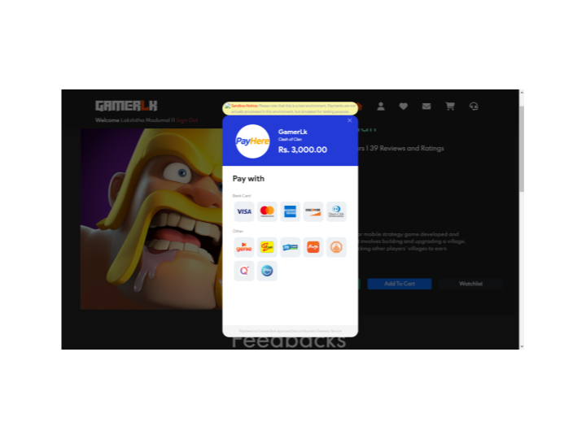

# 🎮 GamerLK - Game Store eCommerce Platform

GamerLK is a fully responsive eCommerce web application for purchasing games across **PC, Mobile, Console, and TV** platforms. Built with **PHP, MySQL, Bootstrap, JavaScript**, it includes features like **PayHere payment integration, email notifications, cart, wishlist, and an admin panel** for managing games & users. 🚀

---

## 🔥 Features
✅ Fully responsive UI with Bootstrap  
✅ Secure **Sign-up / Sign-in** system  
✅ **Game Categories:** PC, Mobile, Console, TV  
✅ **Admin Panel:** Add, edit, delete games & manage users  
✅ **Shopping Cart & Wishlist**  
✅ **PayHere Payment Gateway** integration  
✅ **Email Notifications** for purchases  
✅ **Search & Filter Games** easily  
✅ **Real-world gaming marketplace experience**  

---

## 🛠️ Tech Stack
- **Frontend:** HTML, CSS, Bootstrap, JavaScript  
- **Backend:** PHP, MySQL  
- **Database Management:** MySQL Workbench, HeidiSQL  
- **Server:** XAMPP  
- **Payment Gateway:** PayHere  

---

## 🚀 Installation Guide

1️⃣ Clone this repository:
```bash
git clone https://github.com/akshithamadumal/Gamerlk.git
```

2️⃣ Move the project to your XAMPP `htdocs` folder:
```bash
mv GamerLK /xampp/htdocs/
```

3️⃣ Start **Apache & MySQL** from XAMPP Control Panel.  
4️⃣ Import the **database.sql** file into MySQL (via phpMyAdmin).  
5️⃣ Configure **database connection** in `connection.php`:
```php
$servername = "localhost";
$username = "root";
$password = "your-connection-password";
$dbname = "gamerlk_db";
```
6️⃣ Open the browser and go to:
```url
http://localhost/GamerLK/
```

---

## 👨‍💻 Admin Credentials
- **Username:** `your-email`
- **Password:** `send-verification-code`

Use these credentials to access the **Admin Panel**.

---

## 📸 Screenshots










---

## 🌟 Contributing
Pull requests are welcome! If you'd like to contribute, follow these steps:
1. Fork the repository
2. Create a new branch (`feature-new`)
3. Commit changes
4. Push & create a pull request

---

## 📩 Contact
For any issues or inquiries, reach out:

📧 Email: mandujayaweera2003@gmail.com 
🔗 GitHub: [lakshithamadumal](https://github.com/lakshithamadumal)  

---

💙 **Like this project? Give it a ⭐ on GitHub!**
